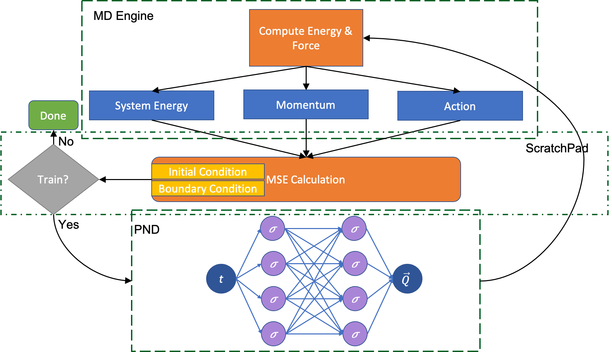

---
# Feel free to add content and custom Front Matter to this file.
# To modify the layout, see https://jekyllrb.com/docs/themes/#overriding-theme-defaults

short_name: Taufeq
location: Los Angeles
position: Graduate Student
custom_css: people.css
---

  

    

      <h3 class="border-top border-gray-dark">About</h3>
      

        Taufeq is a Research Assistant at the Collaboratory for Advanced
        Computing and Simulations at the University of Southern California, Los
        Angeles. He has specialized in fluids and computational science and has
        been working on data-driven solutions of partial differential equations
        for problems in science and engineering.
      

      

        His expertise is in developing high performance numerical simulation
        codes for parallel and heterogeneous architectures for accurate
        visualization and optimization.
      

      

        He is also led teams to advance their technical stacks and digital
        presence while contributing across research labs, multidisciplinary
        research initiatives and course materials.
      

      

        Taufeq holds dual master degrees in Computer Science and Mechanical
        Engineering from the University of Southern California. He is also a
        graduate of Osmania University, from where he earned his bachelor in
        engineering with high distinction.
      

    

    

      <h3 class="border-top border-gray-dark">Expertise</h3>
      <ul>
        <li>Java</li>
        <li>Ruby on Rails</li>
        <li>C++</li>
        <li>C#</li>
        <li>Python</li>
        <li>Git</li>
        <li>Node.js</li>
        <li>React</li>
        <li>Vue</li>
        <li>MPI</li>
        <li>OpenMP</li>
        <li>CUDA</li>
      </ul>
    

  

  

    <h3 class="border-top border-gray-dark">Projects</h3>

    <h4 id="usc-cacs-lab-website---web-administrator--designer">
      USC-CACS Lab Website - Web Administrator &amp; Designer
    </h4>
    

       Developed a website and
      publications management system according to the design/identity standards
      of USC and long term maintainability. For a lab with a growing number of
      publications, I automated the list page generation by setting up a
      continuous integration pipeline which runs test and builds an updated list
      of publications. I used ruby’s Nokogiri library to populate the contents
      of the page based on XML data files for newer publications. I produced
      instructions/tutorials to interact with the new publication management
      system.
    

    <h4
      id="responsive-react-node-powered-news-app-for-guardian-and-nytimes-news"
    >
      <a href="http://ec2-3-21-245-28.us-east-2.compute.amazonaws.com:3000/"
        >Responsive React, Node powered News app for Guardian and NYTimes
        news</a
      >
    </h4>
    

       Developed a full stack
      responsive news app using React and Node JS backend. Designed several
      components to enhance reusability and hosted on Amazon EC2 web server. The
      news information for this application is fetched from Guardian and NYTimes
      API to get real time news data. The backend utilizes REST calls using Node
      and Express.Js frameworks. The styling for various components in this app
      is done using React-bootstrap.
    

    <h4 id="ios-weather-and-news-app">ios Weather and News App</h4>
    

       A local weather and
      news app for ios devices which built with the latest SwiftUI framework.
      Weather data pulled the weather channel API, along with news and trending
      search statistics from the guardian news.
    

  

  

    <h3 class="border-top border-gray-dark">Hackathons</h3>
    <h4 id="hackthis-illinois-2020---zmate">
      <a href="https://devpost.com/software/zmate"
        >HackThis Illinois 2020 - Zmate</a
      >
    </h4>
    

       Zmate is a tool for students taking
      classes online. Where every course instructor has their own zoom link,
      there comes the addition of office hours and study sessions - which makes
      it hard to keep track of those links. Zmate is a centralized repository
      for all your course related meetings for a semester where your professors
      and TA’s post all the necessary links to your personal calendar. Ruby on
      Rails, HTML, CSS, Heroku
    

    <h4 id="creating-reality-hackathon-arvr-2018----kungfu-buddy">
      <a href="https://devpost.com/software/kungfu-buddy"
        >Creating Reality Hackathon (AR/VR) 2018 - KungFu Buddy</a
      >
    </h4>
    

    
A VR game which teaches you KungFu!!! HTC VIVE, Unity Game Engine

  

  

    <h3 class="border-top border-gray-dark">Publications</h3>
    <h4
      id="physics-informed-neural-network-software-for-molecular-dynamics-applications"
    >
      <a href="https://arxiv.org/abs/2011.03490"
        >Physics-informed Neural-Network Software for Molecular Dynamics
        Applications</a
      >
    </h4>
    

      
      We have developed a novel differential equation solver software called PND
      based on the physics-informed neural network for molecular dynamics
      simulators. Based on automatic differentiation technique provided by
      Pytorch, our software allows users to flexibly implement equation of atom
      motions, initial and boundary conditions, and conservation laws as loss
      function to train the network. PND comes with a parallel molecular
      dynamics (MD) engine in order for users to examine and optimize loss
      function design, and different conservation laws and boundary conditions,
      and hyperparameters, thereby accelerate the PINN-based development for
      molecular applications.
      <em
        >Taufeq Mohammed Razakh, Beibei Wang, Shane Jackson, Rajiv K. Kalia,
        Aiichiro Nakano, Ken-ichi Nomura, Priya Vashishta</em
      >
    

  

  

    <h3 class="border-top border-gray-dark">Education</h3>
    
<strong>University of Southern California</strong>

    <ul>
      <li>Masters in Computer Science <em>2021</em></li>
      <li>Masters in Mechanical Engineering <em>2018</em></li>
    </ul>

    
<strong>Osmania UNiversity</strong>

    <ul>
      <li>Bachelor in Engineering <em>2016</em></li>
    </ul>
  

